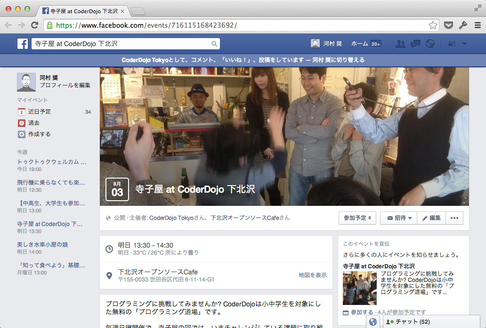
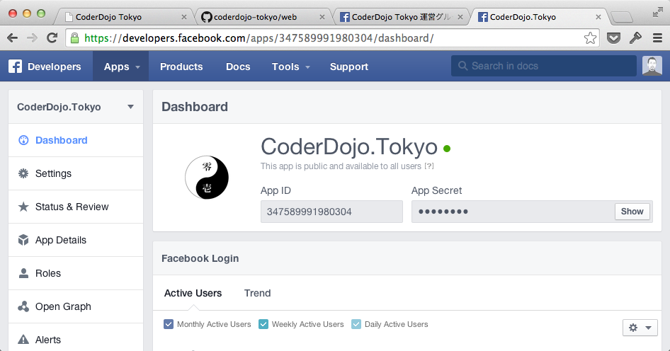
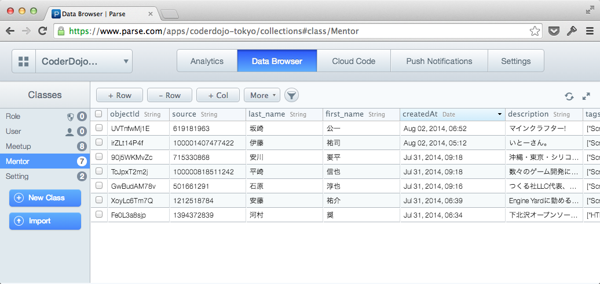
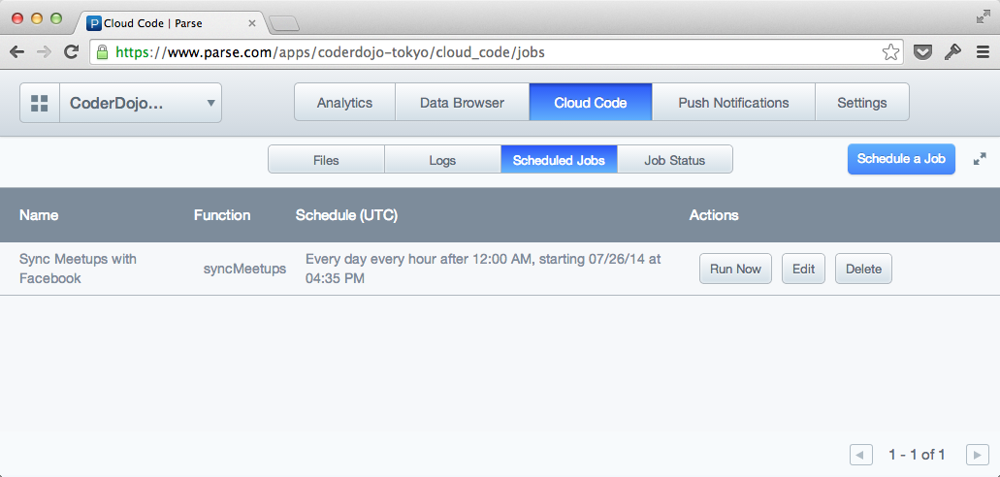

# CoderDojo Web

CoderDojoは小中学生のためのプログラミング道場

## はじめに

このリポジトリは、CoderDojo TokyoのWebサイトのために作られました。他のDojoでもフォークして使えるようになっています。改良点などあれば、どしどしプルリクエストください。不明な点・質問は、[Issues](https://github.com/coderdojo-tokyo/web/issues)へどうぞ。

## サイトの運用

Facebookページが運用されていて、開催情報をFacebookイベントとして公開していることが、前提条件です。また、メンターの出席管理も、Facebookイベントで行います。

### 日常的な更新

- 開催情報をFacebookイベントとして登録 (2,3ヶ月分を事前に登録しておくとGood)

- 各メンターは、参加可能な日程で上記イベントに参加表明します
- メンターが増えた場合は、Parse.comのデータベースに追加 (今のところ手動で)

### デプロイが必要な更新

- 文言の変更
	0. `src/index.html` を書き換えます。
	0. `$ gulp html && parse deploy`
- デザイン変更
	0. `src/css/` 以下を書き換えます。
	0. `$ gulp css && parse deploy`

### ファイル構成

ビルドファイルはリポジトリに含まれません。`cloud`,`public`などは、フォークした後、手元で`$ npm install`すると自動生成されます。(詳しくは後述)

- **`cloud/`**: Cloud Code ※自動生成
- **`public/`**: Parse.comでホスティングする静的ファイル ※自動生成
- **`bower_components/`**: ※自動生成
- **`node_modules/`**: ※自動生成
- **`config/`**: Parse.comへの接続する設定データを格納 ※秘密情報のためgitに含めず
- **`doc/`**: ドキュメント関連
- **`task/`**: gulp.jsのサブタスク
- **`src/`**: ソース
	- **`coffee/`**
		- **`ng`**: AngularJSのコントローラなど
		- **`parse`** Parse.comのクラス、ジョブほか
	- `css`
- `bower.json`
- `package.json`
- `gulpfile.coffee`
- `README.md`: このドキュメント

## サイトをビルドするには

上記の「日常的な更新」以外の作業をするには、環境構築が必要です。また、最初にサイトを作る場合にも必要になります。

### 使っている技術、サービス

- [AngularJS](https://angularjs.org/)
- [Facebook](https://www.facebook.com/)
	- [Graph API 2.0](https://developers.facebook.com/docs/graph-api)
- [Parse.com](https://parse.com/)
	- [Cloud Code](https://parse.com/docs/cloud_code_guide)
	- ホスティング機能
- 開発時
	- [CoffeeScript](http://coffeescript.org/)
	- [Browserify](http://browserify.org/)
	- [BrowserSync](http://www.browsersync.io/)
	- [gulp.js](http://gulpjs.com/)
	- [シンボルフォント](https://github.com/cognitom/symbols-for-sketch)

### ローカルの準備

0. 環境を確認
	- [Node.js](http://nodejs.org/)
	- [gulp.js](http://gulpjs.com/): `$ npm install -g gulp`
0. [このリポジトリ](https://github.com/coderdojo-tokyo/web)をフォーク
0. ターミナルでローカルディレクトリを開く: `$ cd path/to/dir`
0. 依存ライブラリのインストールとビルド: `$ npm install`
0. Watch: `$ gulp watch`
0. 作業開始!

### Facebookの準備

- CoderDojoのFacebookページを開設
- 開催情報をFacebookイベントとして登録
- Facebook Appの作成



### Parse.comの準備

0. [Parse.com](https://parse.com/)のアカウントを取得
0. 空のアプリケーションを作成
0. Facebook Appの設定を`Setting`クラスに登録。keyに次のふたつが設定されたものが必要。
	- facebook_app_id
	- facebook_app_secret
0. メンター情報を`Mentor`クラスに登録 (今のところ手動で)


### デプロイ

Parse.comの[Cloud Code](https://parse.com/docs/cloud_code_guide)と、ホスティング機能を使います。まず、コマンドラインツールをインストールしておきます。

```bash
$ curl -s https://www.parse.com/downloads/cloud_code/installer.sh | sudo /bin/bash
```

`config/global.json`として、下記の内容のファイルを置きます。環境に合わせて、適宜書き換えてください。(同じDojoの人がすでに作っていたら、それをコピーする方が早いかも)

```json
{
  "applications": {
    "<アプリケーション名>": {
      "applicationId": "<アプリケーションID>", 
      "masterKey": "<マスターキー>"
    }, 
    "_default": {
      "link": "<アプリケーション名>"
    }
  }, 
  "global": {
    "parseVersion": "1.2.19"
  }
}
```

次のコマンドを実行すると、`cloud`, `public`フォルダ内がParse.comと同期・デプロイされます。

```bash
$ parse deploy
```

### ジョブの自動実行

Parse.comのサイトにアクセスして、"Cloud Code > Scheduled Jobs"を開きます。"Schedule a Job"ボタンをクリックして、`syncMeetups`をジョブに登録します。実行頻度は、毎時の00分とします。(もっと少ない頻度でもOK)


